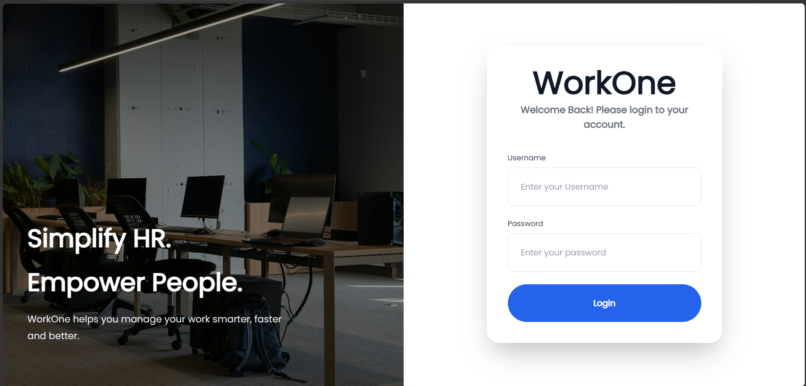
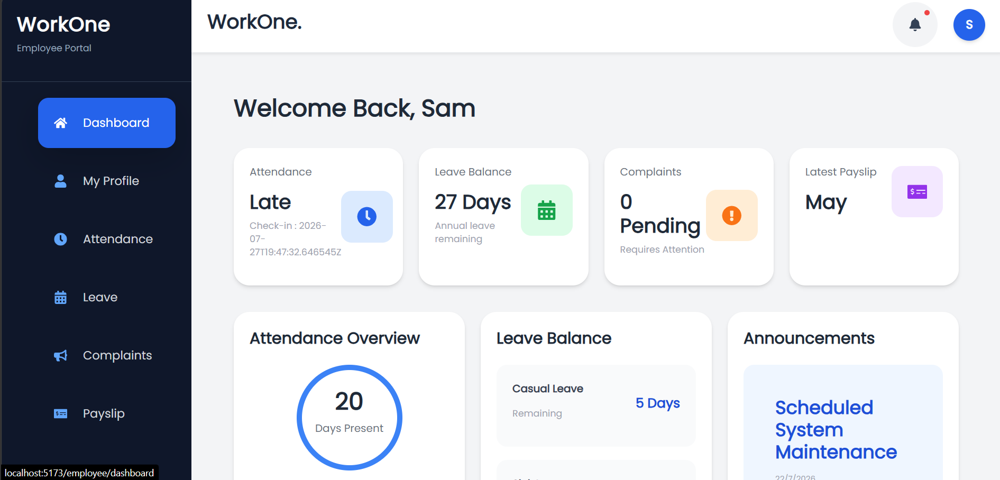
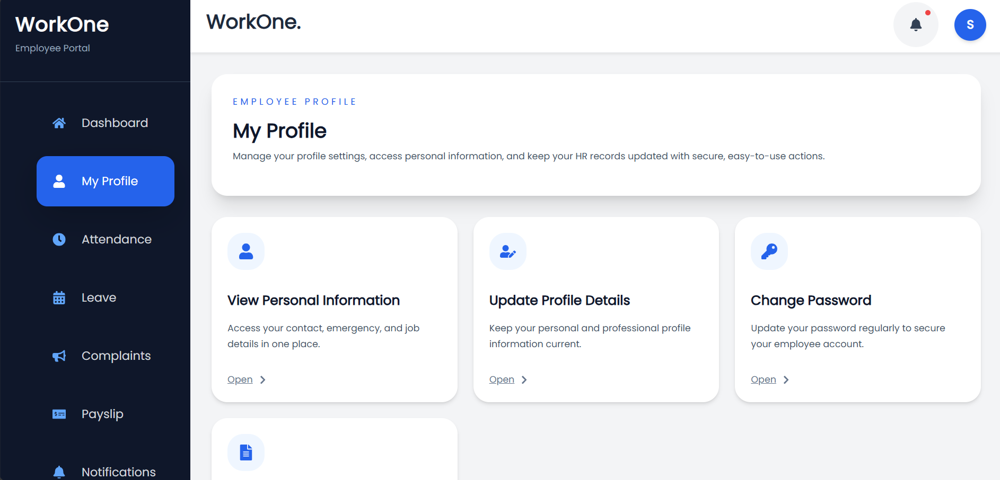
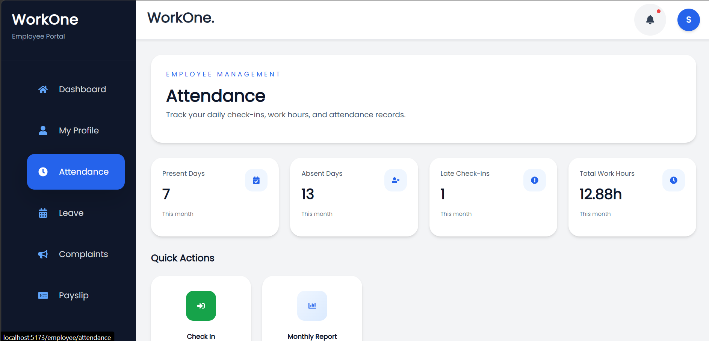
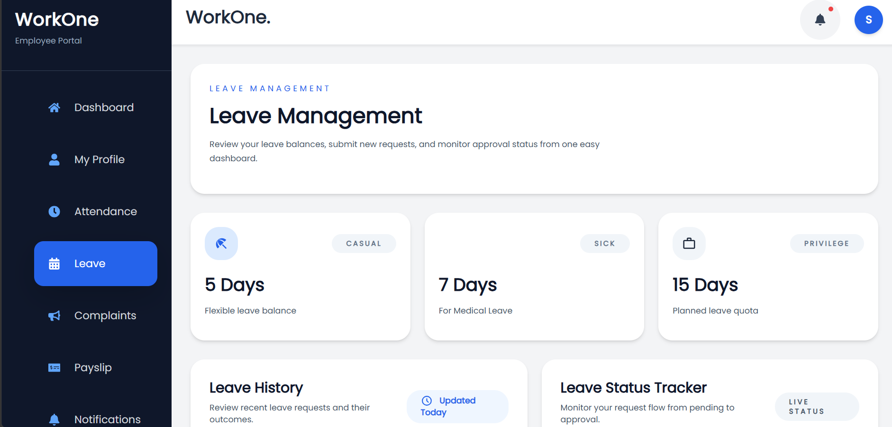
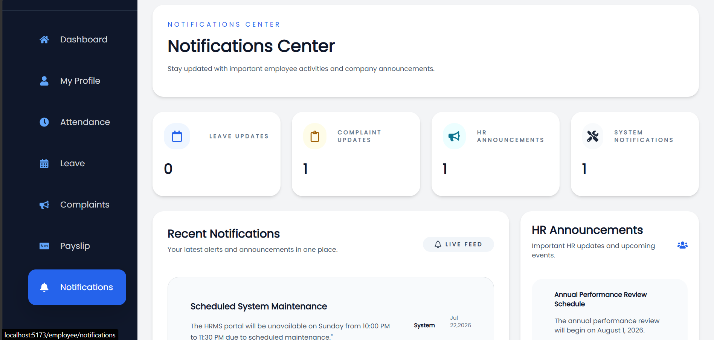
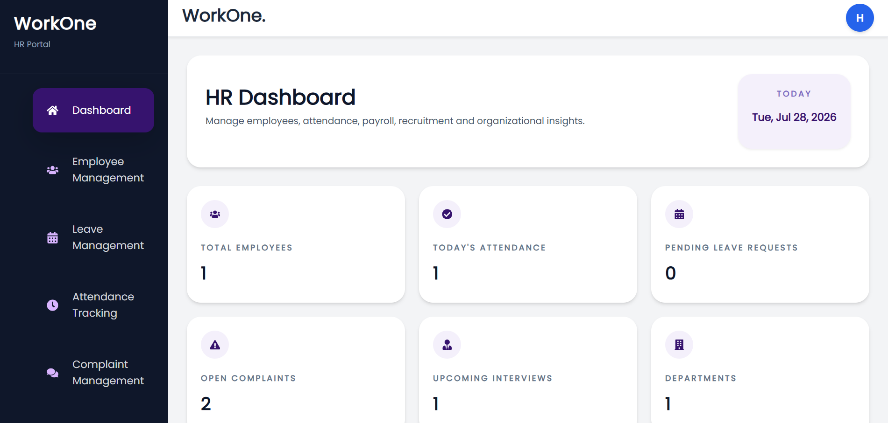

# WORKONE HRMS - Frontend

# 📌 About

**WORKONE HRMS** is a modern Human Resource Management System (HRMS) frontend developed using **React**. It provides separate Employee and HR dashboards with a responsive and user-friendly interface, to efficiently manage employees, attendance, leave requests, complaints, payroll, notifications, and other HR operations.

The frontend communicates with a Django REST Framework backend through RESTful APIs and implements secure JWT-based authentication with role-based access control.

---

# Features

## 👤 Employee Dashboard

- Secure Login & Authentication
- Dashboard 
- Personal Profile 
- Attendance 
- Leave Request 
- Complaints
- Notifications
- Payslip 

---

## 👨‍💼 HR Dashboard

- Dashboard 
- Employee Management
- Attendance Tracking
- Leave Approval
- Complaint Management
- Notifications
- Payslip Management
- Reports and Analytics
- Recruitment and Interviews

---

# 🛠 Technologies Used

React
JavaScript
Fetch API
HTML
TailwindCSS

---

# 📂 Project Structure

```
src/
│
├── api/
├── assets/
├── components/
├── layouts/
├── pages/
│   ├── employee/
│   ├── hr/
├── EmployeeDashboard.jsx
├── Login.jsx
├── App.jsx
└── index.css
└── main.jsx
```

---

# 🔗 Backend API

The frontend consumes REST APIs provided by the Django REST Framework backend.

---

# 🔒 Authentication

- JWT Authentication
- Protected Routes
- Role-based Access Control

---

# 📸 Screenshots

## Login



## Employee Dashboard








---

## HR Dashboard




